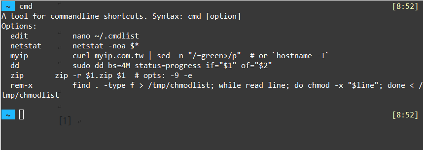

# Command-line Shortcut Tool

A tool for calling command-line shortcuts with ease.

## Description

The default way of creating a command-line shortcut is using `alias`. However, it has its shortcomings, for example it does not support positional parameters ($1, $2, ...). This tool is for creating and managing shortcuts that can execute arbitrary commands.

## Installation

- Put this file under your `~/bin` folder and make it executable via `chmod +x cmd`.

## Screenshot

