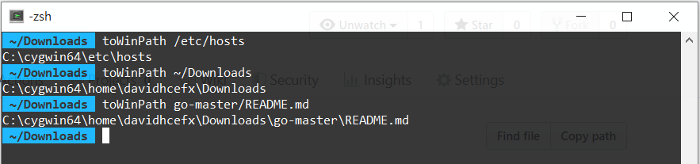

# Convert Cygwin Path toWinPath

## Description

Under *Cygwin*, paths such as `C:\Users` would appear as `/cygdrive/c/Users`, while paths that belong to *Unix* such as `/var/log` are actually `C:\cygwin64\var\log`.
This script converts Cygwin paths to Windows-understandable paths.

## Installation

1. Put this file under your `~/bin` folder and make it executable via `chmod +x toWinPath`.

2. Now, you can run commands such as `explorer $(toWinPath .)` in order to open up `explorer.exe` under that folder.

