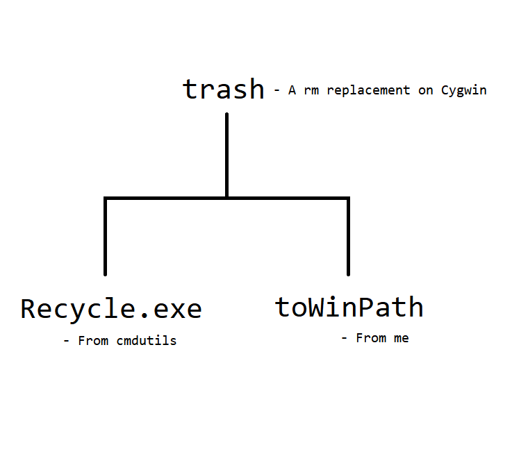

# Trash - A rm replacement on Cygwin

- Ever worried about accidentally deleting something and not being able to recover it? Here are the ways to replace the native `rm` with a safer version of deleting files via moving it to the *Trash bin*.

## How to install

1. Go to http://www.maddogsw.com/cmdutils/, download the zip, and then take out only **Recycle.exe**.

2. Download the script **toWinPath** from [here](https://github.com/davidhcefx/My-Bash-Scripts/tree/master/Convert%20Cygwin%20Path%20toWinPath).

3. Make the above two files *callable* and *runnable*, namely:

	3-1) `chmod +x toWinPath`.

	3-2) Add their paths to the PATH variable. For example, add `PATH=$PATH:~/bin` to your `~/.bashrc` and put them under the ~/bin folder.

4. Now, you can simply run `trash` to delete files safely, without worrying yourself accidentally deleting something. You might also prefer adding an alias like: `alias rm='trash'`.

