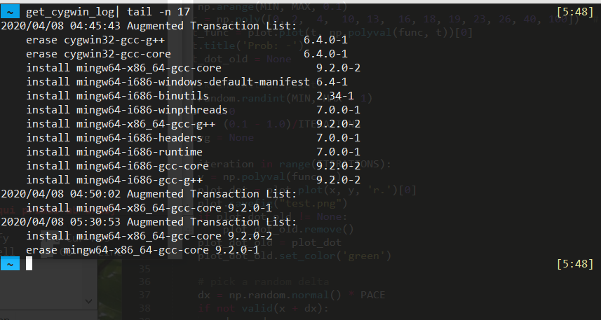

# Get Cygwin Setup Log

Extract the *Augmented Transaction List* from the setup log of Cygwin, which is a list showing which packages we installed in a clear way.

## Why?

- Cygwin's [official installer](https://cygwin.com/install.html) is the **Package Manager** for Cygwin packages. However, it doesn't keep track which packages were installed manually and which are just dependencies. (the "Picked" filter won't show libraries)

- By extracting the transaction list, we can figure out *when*, and ideally *why*, a package has been installed by ourselves.

## Screenshots

