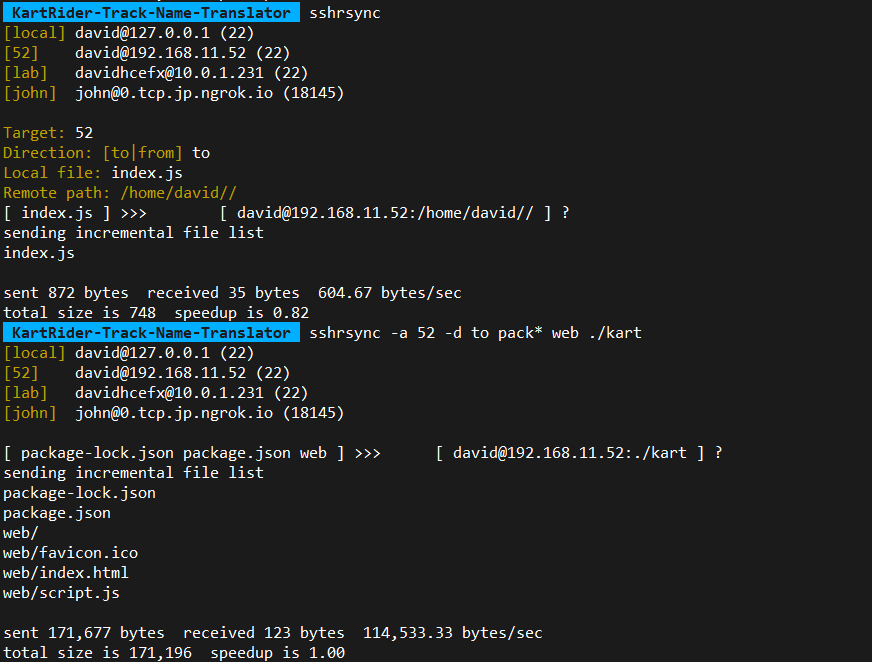

# Rsync Over SSH

An interactive script to make file transfer with `rsync` + `ssh` easier.


## Introduction

The usual way for `rsync` over `ssh` was:

```sh
$ rsync -av -delete -e 'ssh -p 22' user@<remote-ip-address>:/remote/path /local/path
```

Basing on that, this script provides additional features such as:

- Config short aliases for each host addresses (eg. "lab"), as well as their ports.
- Interactive host selection.
- Non-interactive support, i.e. by passing program arguments.
- Simplified usage, i.e. typing lesser to achieve the same thing.


## Usage

```
Syntax: sshrsync [-a alias] [-d (to|from)] [src_path]... [dst_path]
        The paths can be either relative or absolute.
```

Please edit the script and add your hosts before running it. By passing no argument, it would enter interactive mode.


