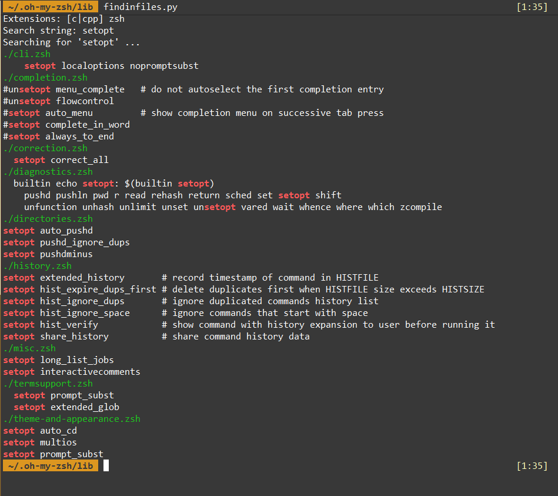

# Search Keyword in Files

Searching for cross references within a huge code base can be cumbersome. This is a simple and efficient tool to perform file-content search within a subdirectory.

## Usage

```csh
Syntax: findinfiles.py (-i|-v|-h)
        -i:     Case insensitive search.
        -v:     Verbose.
        -h:     Help.
```

## Screenshot


