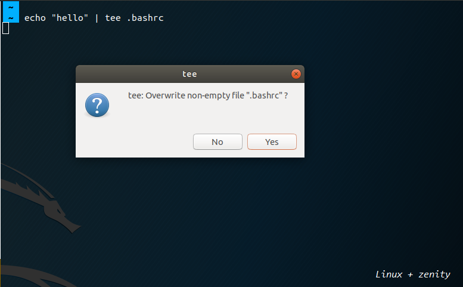
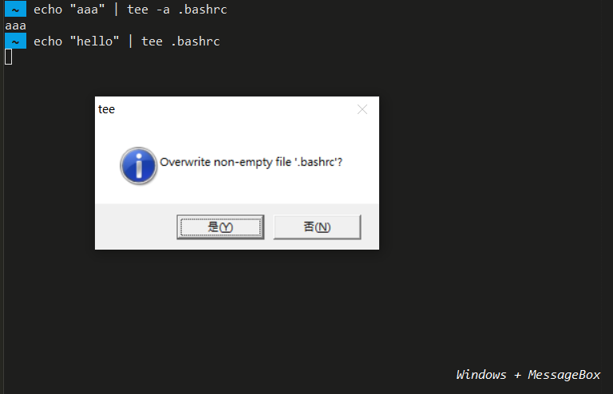

# tee-safe - Tee with Prompting

- Ever having this catastrophic experience using `tee` to accidentally overwritten some files and couldn't fully recover them? To prevent it from happening again, you need this script!

## Installation

1. Put this file `tee-safe` under your `~/bin` folder.
  
2. a) If you are on Linux, please ensure that [Zenity](https://packages.ubuntu.com/search?keywords=zenity) has been installed.  

   b) If you are on Windows, please install the tool [MessageBox](https://github.com/davidhcefx/Windows-MessageBox-for-Cmd) first.  
   After that, uncomment [Lines 8-13](https://github.com/davidhcefx/My-Bash-Scripts/blob/0f35c73615332b07d0e409bf690b899fb09aad35/tee-safe%20-%20Tee%20with%20Prompting/tee-safe#L8-L13) and comment out [Line 14](https://github.com/davidhcefx/My-Bash-Scripts/blob/0f35c73615332b07d0e409bf690b899fb09aad35/tee-safe%20-%20Tee%20with%20Prompting/tee-safe#L14).

3. Finally, you can set up aliases like `alias tee='tee-safe'` to wrap up the original one.

## Linux

## Windows

